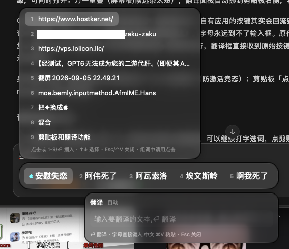
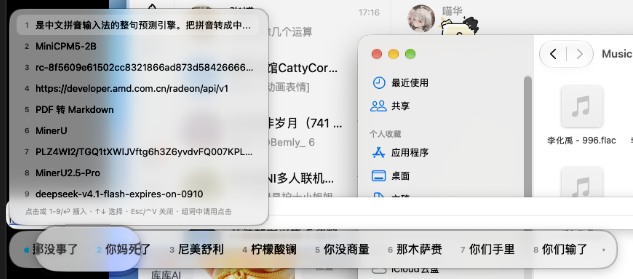
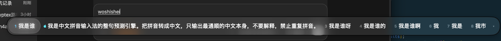
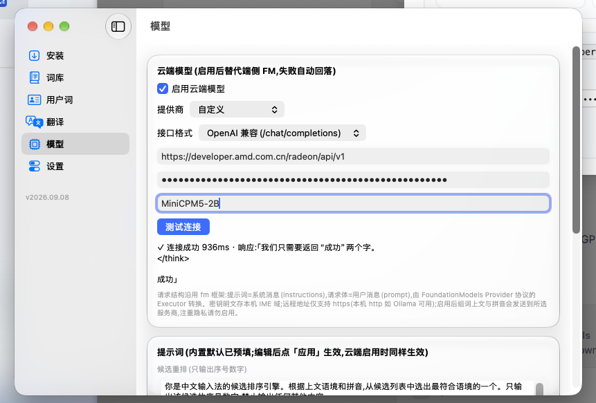

# AFM拼音 (afm-ime)

macOS 液态玻璃(Liquid Glass)风格中文拼音输入法,大模型增强候选预测:**端侧 Apple Foundation Models**(隐私安全,离线可用)+ **可选云端模型**(OpenAI 兼容 / Anthropic,设置中心配置)。**纯 Swift、无第三方依赖;macOS 27+,需要 Xcode 构建(水滴折射依赖其 Metal 工具链)**。

-blue) 

## 功能

- **词典引擎**:多源词库 **698.6 万条**(含简拼派生键,原始词条 ~350 万),编译为二进制 `dict.bin`,mmap 零拷贝加载(<1ms),热循环查询 ~0.2ms
  - rime-ice 雾凇拼音(tencent 98w + base 55w + ext 34w + 8105 单字)
  - 萌娘百科(mw2fcitx 月更)12.9w / 中文维基 167w / Minecraft Wiki 1.1w / 蔚蓝档案 / THUOCL 9.4w / ali-words 黑话 / 自维护梗合集(无拼音源编译期自动注音)/ CLDR emoji / 化学式·希腊字母
- **用户词库**:上过屏的词按拼音键记忆,同键输入**最高优先档直出、越打越顺**(跨重启);词组自动学习(分段组句合成词组,修词典外短语冷启动);简拼、半截音节宽松匹配(mebengz→没绷住、nh→女孩)
- **大模型增强**(重排/整句/翻译三入口共用;**云端→端侧→纯词典逐级静默回退,永不阻塞打字**):
  - *候选重排*:打字停顿 ~0.4s 后,模型根据上文把最合适的候选提到第 2 位(✦ 标记,不顶掉首选、防突然换词打错),到达后无感刷新
  - *整句预测*:长拼音词典覆盖不住时,光标处先显示占位,模型输出整句候选
  - *云端模型(可选)*:经 FoundationModels 官方 Provider 协议接入,与端侧同一套提示词(重排/整句/翻译×2 四段可整段覆盖,草稿-应用模式);设置中心「模型」页配置——提供商预设 9 种(OpenAI/Anthropic/DeepSeek/Kimi/智谱/通义/豆包/Ollama/自定义)、OpenAI 兼容 vs Anthropic 双线格式、Base URL/API Key/模型名、测试连接
- **拼音切分与模糊音**:音节树最多 12 路切分枚举,尾部不完整音节实时匹配;模糊拼音 zh/z、ch/c、sh/s、an/ang、en/eng、in/ing(含 ian↔iang、uan↔uang)双向模糊,精确拼音候选永远优先;简拼(awsl→阿伟死了)与全拼混输(n+hao→你好);渐进前缀兜底(超长句出「你是X」);词格 DP 整句组词
- **组词中 Shift+字母 = 大写英文字尾**:GDP 这类混排直接打,随候选一并上屏
- **伴随面板**(液态玻璃,浮在候选条下方/上方,无候选条时屏幕右上角):
  - *剪贴板历史* `⌃V`:免激活不打断组词,复制过的文本自动收录(50 条/跨重启),点击或数字键插回光标
  - *内联翻译* `⌃F`:组词中把当前高亮候选的译文单行显示在候选框,空格上屏译文;独立翻译页在设置中心(中↔英方向自动,结果可复制)
- **液态玻璃候选窗**:NSPanel + NSGlassEffectView(macOS 27 真·Liquid Glass,亮暗自适应),跟随光标;选中态 = 透明液态玻璃水滴(Metal 折射镜头),按住可左右拖动、松手吸附最近候选上屏;候选条恒显前 8 个,`↓` 展开滚动网格
- **控制中心**(嵌在输入法 bundle 内,`⌃S` 或输入菜单「设置…」打开):七区——**安装**(一键安装并启用/更新/卸载)、**词库**(698 万条分页浏览+拼音搜索)、**用户词**(词/拼音键/次数/乘数管理)、**翻译**(端侧 FM 中↔英互译)、**模型**(云端配置+提示词覆盖)、**测试**(实验交互开关)、**设置**(模糊拼音/全角标点/FM 增强/词频学习/候选条字号/**快捷键自定义**),写 IME 域即时生效

## 截图

**候选条与伴随面板** —— `⌃V` 剪贴板历史 / `⌃F` 翻译浮窗与候选条并存,不打断组词:



**剪贴板历史** —— 复制过的文本自动收录,点击或数字键插回光标:



**整句预测** —— 长拼音词典覆盖不住时,模型输出的 ✦ 整句候选插在第 2 位,空格直接上屏:



**设置中心「模型」页** —— 云端模型配置(提供商 / 接口格式 / Base URL / API Key / 模型名 / 测试连接)与提示词覆盖:



## 构建 / 安装

**需要 Xcode 27+**(主构建路径;Metal 工具链是 Xcode 的独立组件,首次需单独下载一次)。

```sh
# Metal 工具链组件(~839MB,一次;DEVELOPER_DIR 指向你的 Xcode 安装)
DEVELOPER_DIR=/Applications/Xcode-beta.app xcodebuild -downloadComponent metalToolchain

scripts/build_dict.sh       # 词库源变更后全量重编 Data/dict.bin(rime-ice+外部词库,~22s)
scripts/package.sh          # xcodebuild(macOS 27 SDK)+ Metal shader → default.metallib
                            # 未装 Xcode 自动回退 swift build(CLT):可构建,但水滴无折射
```

产物 `build/AFM拼音.app` = 输入法引擎 + 内嵌设置中心(`Contents/PlugIns/AFMSettings.app`,顶层只有一个 App 条目)。

- **首次安装**:`open build/AFM拼音.app` → 未安装态自动弹设置中心 → 「安装并启用」(或命令行 `scripts/install.sh`),然后**注销并重新登录一次**(TIS 登录扫描收录);之后装卸永久生效
- **分发(.pkg)**:`scripts/make_pkg.sh` 出 `build/AFM拼音-<版本>.pkg`——装到系统级 `/Library/Input Methods`(双击安装,管理员授权;首次同样需注销重登一次)。未签名:`sudo installer -pkg AFM拼音-<版本>.pkg -target /` 可直接装;升级安装幂等(已启用不触碰 TIS,无需注销)。已有用户级安装的机器先跑 `AFMInput --uninstall` 再装,避免双份
- **日常更新(部署铁律)**:重跑 package.sh 后**只做换盘+重启输入法,不要跑 install.sh**(它的 enable 流程会把输入源摘掉):

  ```sh
  rm -rf ~/Library/Input\ Methods/AFM拼音.app && cp -R build/AFM拼音.app ~/Library/Input\ Methods/ && killall AFMInput && open ~/Library/Input\ Methods/AFM拼音.app
  ```

## 使用

- `Ctrl+Space` 或菜单栏切换到 AFM拼音;**轻点 `Shift` 中英切换**(系统级监听、全部应用生效,跨重启记忆;英文模式无候选框、标点半角直通)
- 中文模式:打拼音 → 数字 `1-8` 选词 / `空格` 上屏高亮候选 / `回车` 上屏拼音原文(网格展开时回车=空格上屏选中);选中候选为透明水滴,**按住左右拖动,松手吸附上屏**(设置中心「测试」可开「固定透镜」模式:水滴钉在原地,整条候选栏从它下面滑过)
- `←→` 移动高亮(越过第 8 个自动展开网格),`↓` 展开候选网格(8 列,滚轮/滚动条滚动、边缘跟随,移回首行或顶行 `↑` 收起),`=`/`-` 翻页,候选条 `▾`/`▴` 展开收起,`Esc` 取消组词;网格内数字键按水滴所在行的 1-8 选词
- `⌃V` 剪贴板历史 / `⌃F` 内联翻译 / `⌃S` 设置中心(三键均可在设置中心自定义,修饰键固定 ⌃);`⌃;` 打开系统「显示表情与符号」;emoji 直接拼音打(`xiaolian`→😀,词库来自 CLDR 中文注解)
- 组词中按住 `Shift` 敲字母 = 大写英文字尾(如 GDP),随候选一并上屏
- 中文标点自动全角：，。；：？！（）【】「」《》、·～,以及 `Shift+-`→——、`Shift+6`→……、`Shift+4`→￥;引号 `'`→‘’、`Shift+'`→“”,均成对交替(`-`/`=`/空格/数字保持半角)
- FM/云端整句:长拼音停顿后出现 ✦ 候选,`空格` 直接上屏

## Debug

```sh
scripts/debug.sh        # 重启输入法,实时跟踪 /tmp/afm-ime.log
scripts/debug.sh --stop # 关闭 debug(标志文件 /tmp/afm-ime-debug)
```

## 结构

```
Sources/
├── IMECore/        # 引擎核心:词库(DictStore mmap)、拼音切分、候选引擎、FM 层(FMReranker 统一出口:
│                   #   云端 CloudProvider → 端侧 FoundationModels → 纯词典)、用户词频与用户词库、
│                   #   模型偏好(ModelPrefs/CloudProvider)、TIS 安装器、debug 日志
├── AFMInput/       # 输入法主体(IMKServer/InputController/液态玻璃候选窗+水滴/⌃V·⌃F 伴随面板/
│                   #   Shift 中英监听)+ 安装 CLI
├── AFMApp/         # 设置中心(六区;打包为引擎 bundle 内 PlugIns/AFMSettings.app 独立进程)
├── DictCompiler/   # 多源词库 → dict.bin 编译器(rime yaml/撇号拼音/词频 TSV/源码提取/markdown)
├── DictBench/      # 词库加载/查询基准(含各外部词库源回归查询)
└── *Bench/         # FMStructBench / CloudModelBench / ProviderBench(FM 框架与云端协议实测)
vendor/             # 词库源 + 参考实现(rime-ice、squirrel、fcitx5-macos、AndroidLiquidGlass 等)
Experiments/        # FM 框架测绘、梗合集词库等实验材料
scripts/            # package / build_dict / install / uninstall / debug 等全部脚本
Data/dict.bin       # 编译产物(git 忽略,build_dict.sh 重新生成)
```

## 性能(本机 macOS 27 / M 系列)

| 场景 | 耗时 |
|---|---|
| 词库加载(mmap) | 0.2–1ms |
| 单次候选查询 | 0.1–4ms |
| FM 重排(暖) | ~350ms(异步,不阻塞打字) |
| FM 整句(暖) | ~350ms(占位等待) |

云端模型延迟取决于网络与提供商(请求 15s 超时,失败自动回落端侧,再回落纯词典)。
